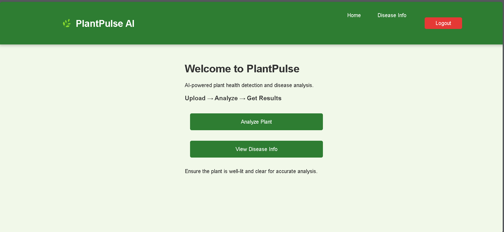
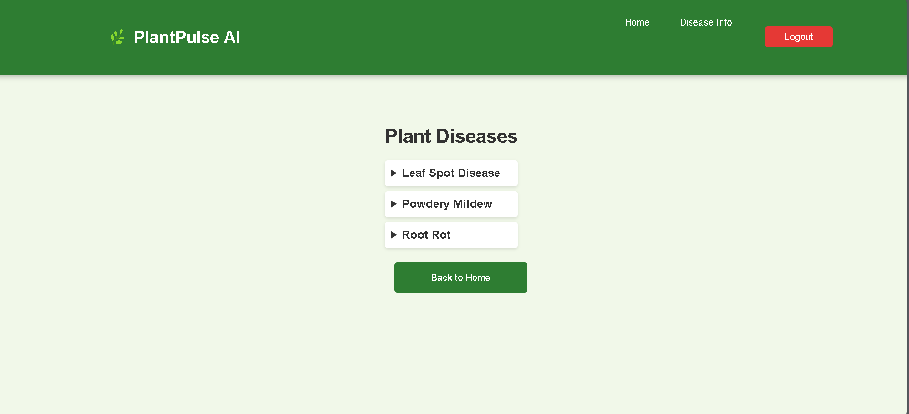
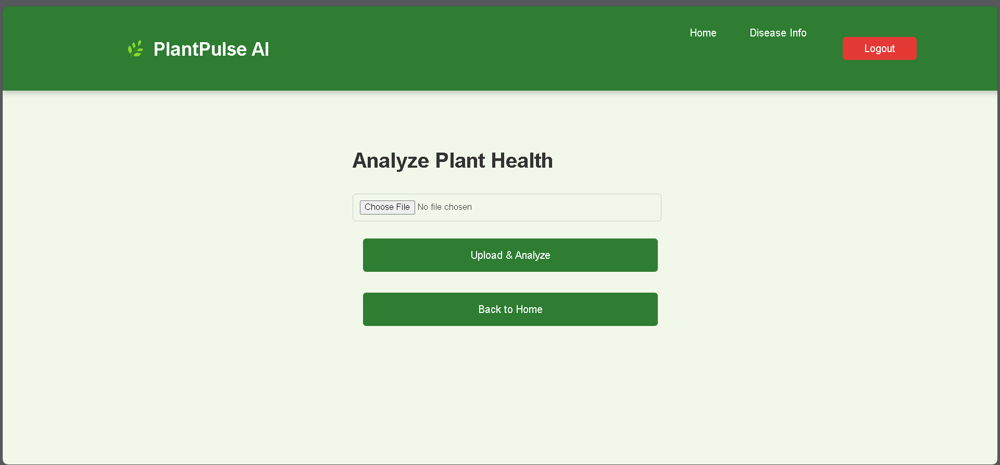
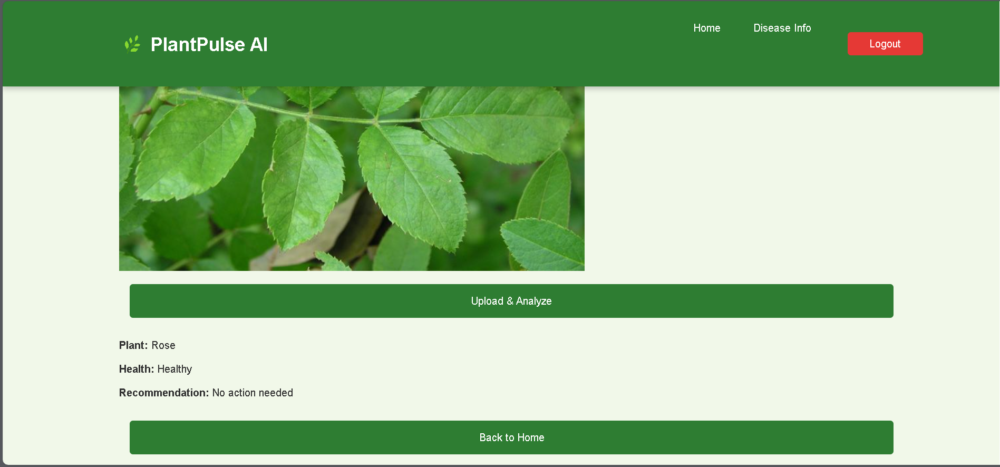

# 🌿 PlantPulse AI  
*A Generative AI Project for the IBM Granite Hackathon*  

🚀 **PlantPulse AI** is an AI-powered application that leverages **IBM Watson AI & Generative AI** to detect plant diseases from images. It helps farmers and researchers improve crop health by providing accurate disease identification.  

---

## 🏆 IBM Generative AI Hackathon  

This project was built during the **IBM Generative AI Hackathon** to advance AI-driven agriculture solutions.  

- ⏳ **48-hour challenge** to develop an AI-powered solution.  
- 🤖 **AI-driven plant disease detection** using IBM Watson AI.  
- 🔗 **Tech Stack:** React.js, Flask, IBM Watson AI, SQLAlchemy, Tailwind CSS.  

---

## 🚀 Features  

**AI-driven disease detection** using IBM Watson AI.  
**Interactive dashboard** built with React-Vite & Tailwind CSS.  
**Secure authentication** using JWT.  
**Database integration** with SQLite for disease records.  

📌 **[Setup & Installation →](SETUP.md)**  
📌 **[Meet the Contributors →](CONTRIBUTORS.md)**  

---

## 📸 Screenshots  

| **Login Page** | **Home Page** | **Disease Info Page** |
|---------------|-------------|----------------|
|  |  |  |

| **Disease Detection** | **Disease Info Page** |
|----------------------|----------------------|
|  |  |

---
# 🛠️ Setup & Installation  

Follow these steps to install and run **PlantPulse AI** locally.  

### ** Clone the Repository**

git clone https://github.com/your-repo/plantpulse-ai.git
cd plantpulse-ai

### ** Setup Environment **
SECRET_KEY=your_secret_key
DATABASE_URL=sqlite:///database.db
IBM_WATSONX_API_KEY=your_ibm_api_key
IBM_WATSONX_URL=your_ibm_url

### **Initialize & Run Flask Backend **
cd backend
flask db init
flask db migrate -m "Initial migration"
flask db upgrade
flask run

### **Install & Run Frontend (React)++
cd frontend
npm install
npm run dev

---

### 📄 **CONTRIBUTORS** 

Meet the amazing team behind **PlantPulse AI**!  

| Name         | Role                      | GitHub Profile |
|-------------|---------------------------|---------------|
| Nyambura Gachahi | Lead  | [GitHub](https://github.com/Nyambura-climate)  |
| Rudrani Mahajan  | Frontend Developer      | [GitHub](https://github.com/m-rudrani)  |
|Amon Cheruiyot   | Backend & AI Developer  | [GitHub](https://github.com/AmonCheruiyot)  |

---
## ⭐ Support & Contributions  

If you find this project helpful, please **⭐ star this repo**!  
Want to contribute? Open a **pull request** or create an **issue**.  

🚀 **Happy Coding!** 🚀  
